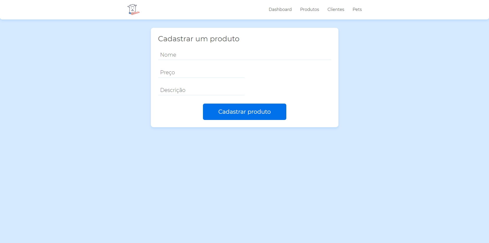

<h1 align="center">
    
</h1>

  <!--:white_check_mark: <a href="https://andreadcsousa.github.io/alura_arquitetura_css/" target="_blank">Veja a página</a>&nbsp;&nbsp;&nbsp;|&nbsp;&nbsp;&nbsp;-->
  :white_check_mark: <a href="https://www.alura.com.br/curso-online-javascript-web-validacao-formularios-html5" target="_blank">Conheça o curso</a>

# :computer: Projeto
 
- Idealizador: Alura
- Projeto: Formação Front-End
- Lado da força: Front-End
- Tipo: Validação de formulário
- Etapa: Type, Data, Math e API

# :rocket: Tecnologias

Esse projeto foi desenvolvido com:

E com a API ViaCEP:

# :art: Layout

  